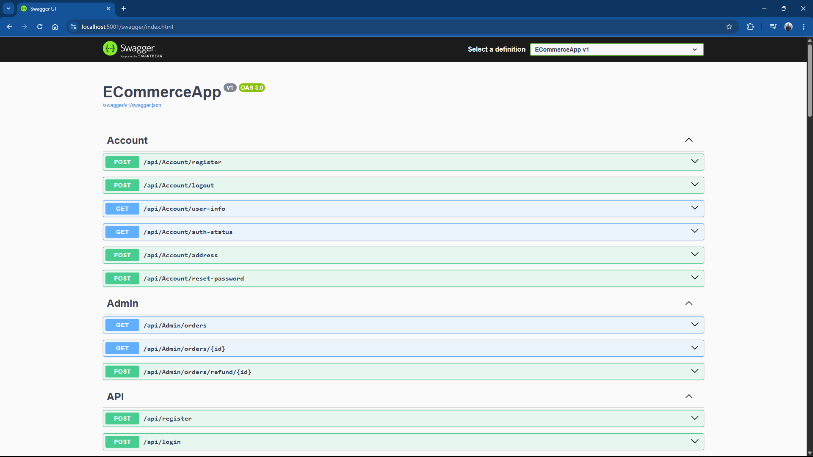
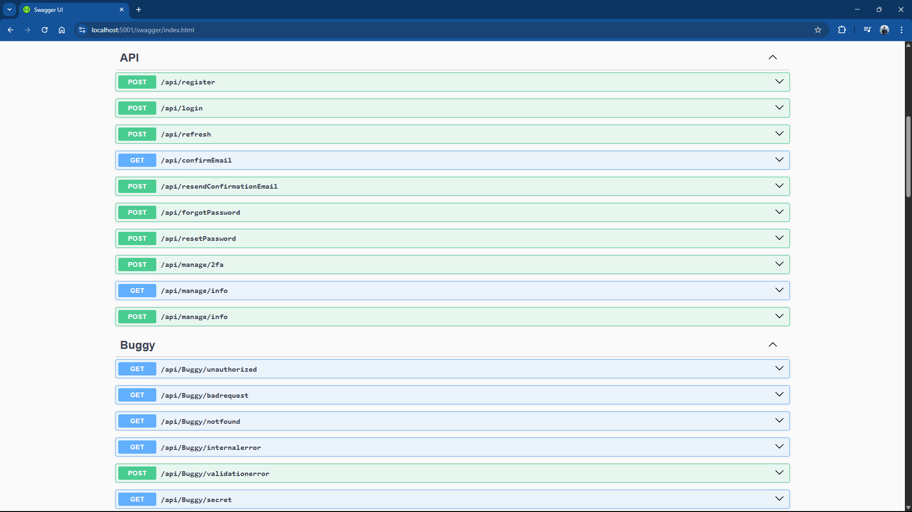
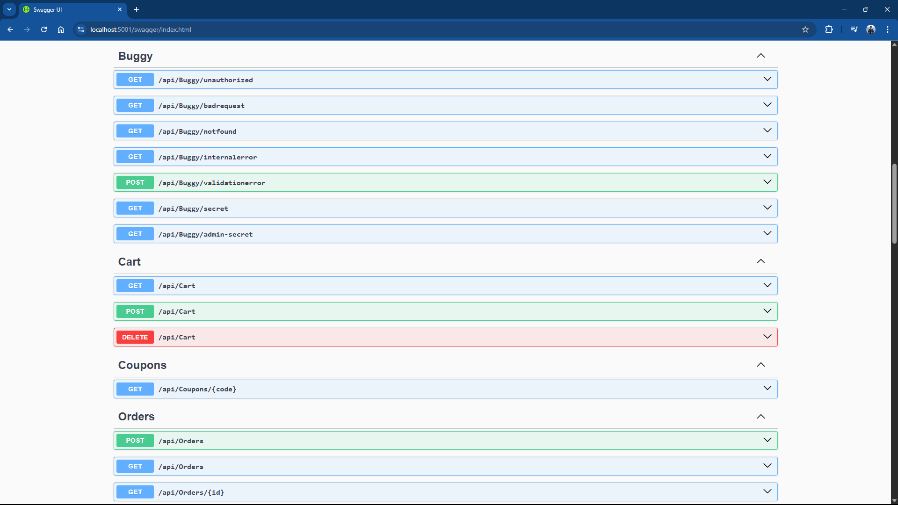
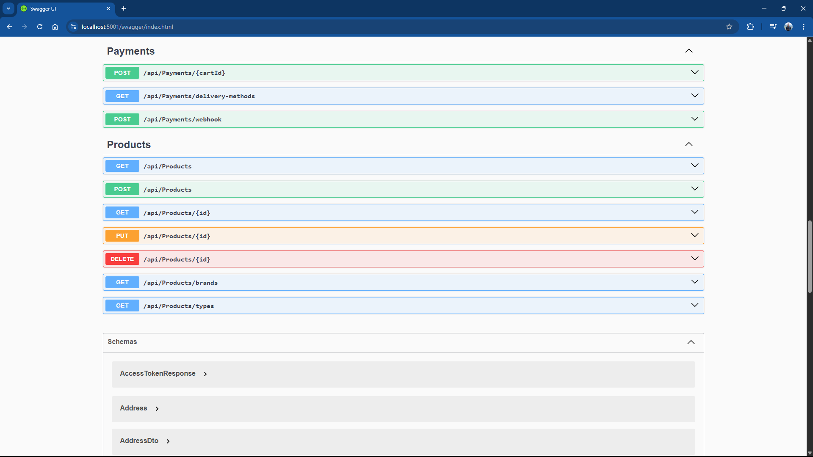

# E-Commerce App

Developed an E-Commerce web application using C# and ASP.NET Core Web API, following Clean Architecture principles. Implemented Repository, Unit of Work, and Specification patterns for maintainable and scalable code. Used Entity Framework Core as the ORM for database operations with SQL Server. Integrated ASP.NET Identity for secure login, registration, and role-based authorization. Key features include product pagination, sorting, searching, and filtering; shopping basket stored in Redis cache; and real-time notifications using SignalR WebSockets. Payment processing was handled via Stripe, supporting the latest EU 3D Secure standards. The frontend was built with Angular, utilizing reusable components, directives, pipes, services, guards, and reactive forms, along with lazy-loaded routes for performance optimization. The user interface was styled using Angular Material and Tailwind CSS.

## Frontend Project

[e-commerce-app](https://github.com/pranto1209/e-commerce-app)

## Backend Project

[ECommerceApp](https://github.com/pranto1209/ECommerceApp)

## Screenshots










## Stripe

* Setup a local listener

```bash
.\stripe login

.\stripe listen --forward-to https://localhost:5001/api/payments/webhook -e payment_intent.succeeded
```

* Stripe test cards are available [here](https://docs.stripe.com/testing#cards) to pay for the orders


## Docker

* The app uses both SQL Server and Redis. To start these services run the command from the solution folder. These are both configured to run on their default ports so ensure there have no conflicting DB server running on either port 1433 or port 6379.

```bash
docker compose up -d 
```


## Scripts
```bash
# Add Migrations
dotnet ef migrations add ECommerceApp -s API -p Infrastructure

# Update Database
dotnet ef database update -s API -p Infrastructure

# Install Windows Subsystem for Linux
wsl --install

# Open WSL Ububtu Terminal
wsl.exe -d Ubuntu

# Install Redis
sudo apt update
sudo apt install redis-server
sudo service redis-server start
redis-cli
> ping

# Install Redis using Docker
docker run --name redis -p 6379:6379 -d redis
```
