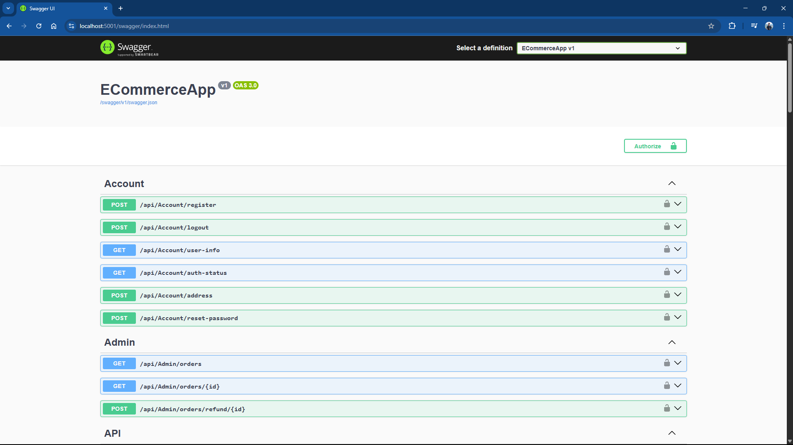
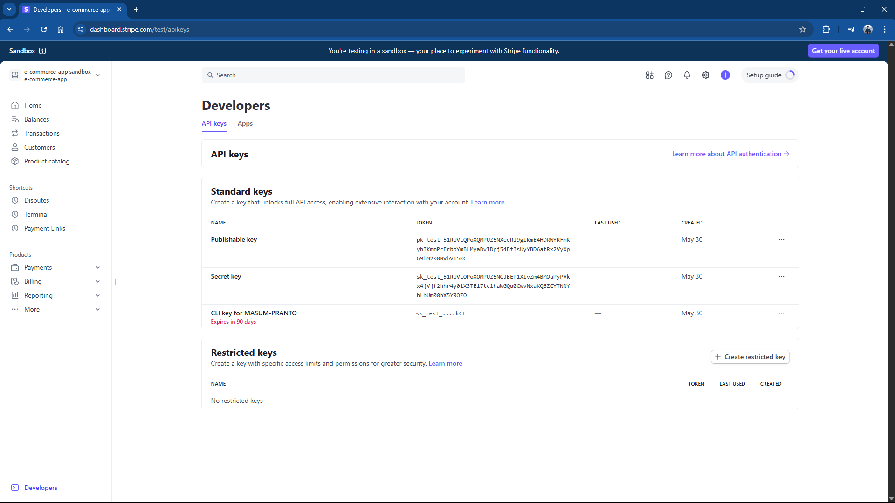
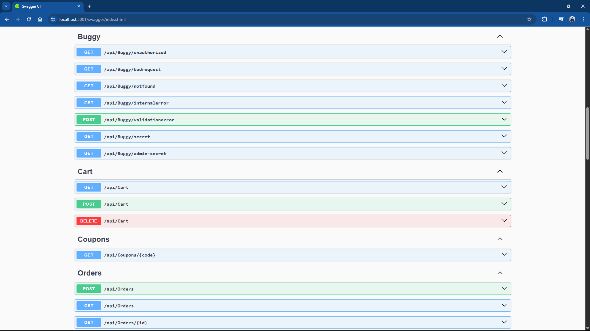
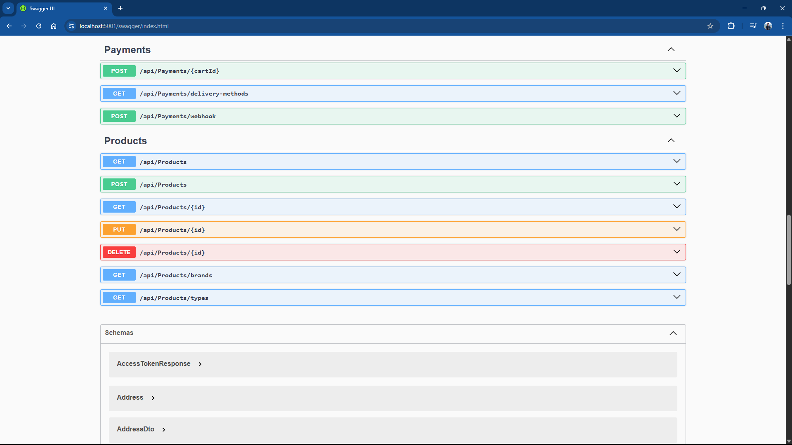
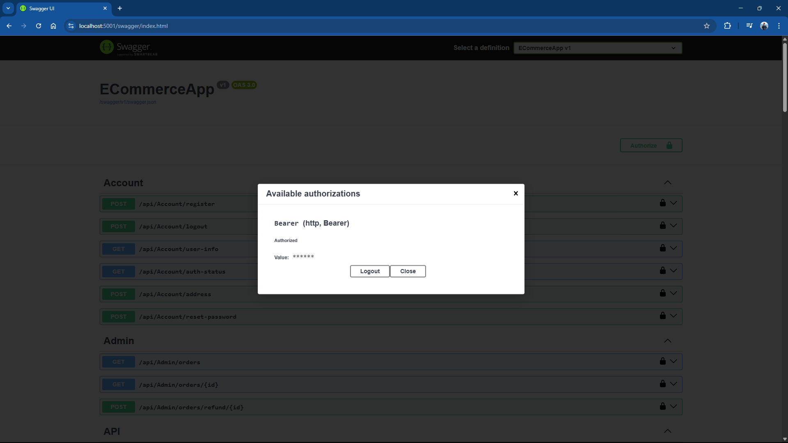

# ECommerceApp

A web application for E-commerce. C# ASP.NET Web API used for Backend RESTful API Services. Entity Framework used for queries and updates the database. ASP.NET Identity used for login and registration. Includes paging, sorting, searching, filtering, shopping cart, checkout features. Payments via Stripe using the new EU standards for 3D secure. Angular used for Frontend development to consume REST API. Used Angular routing and Angular services.


## Running the project

## Stripe

* Most of the functionality will work without Stripe but if you wish to see the payment functionality working too then you will need to create a Stripe account and populate the keys from Stripe.  In the API folder create a file called ‘appsettings.json’ with the following code:

```json
{
    "Logging": {
      "LogLevel": {
        "Default": "Information",
        "Microsoft.AspNetCore": "Warning"
      }
    },
    "StripeSettings": {
      "PublishableKey": "pk_test_REPLACEME",
      "SecretKey": "sk_test_REPLACEME",
      "WhSecret": "whsec_REPLACEME"
    },
    "AllowedHosts": "*"
  }
```

* To use the Stripe webhook you will also need to use the StripeCLI, and when you run this you will be given a whsec key which you will need to add to the appsettings.json.   To get this key and instructions on how to install the Stripe CLI you can go to your Stripe dashboad ⇒ Developers ⇒ Webhooks ⇒ Add local listener.   The whsec key will be visible in the terminal when you run Stripe.

* Once you have the Stripe CLI you can then run this so it listens to stripe events and forward them to the .Net API:

```bash
.\stripe login

.\stripe listen --forward-to https://localhost:5001/api/payments/webhook -e payment_intent.succeeded
```

## Docker

* The app uses both Sql Server and Redis.   To start these services then you need to run this command from the solution folder.  These are both configured to run on their default ports so ensure you do not have a conflicting DB server running on either port 1433 or port 6379 on your computer:

```bash
docker compose up -d 
```

* You can use the Stripe test cards available from [here](https://docs.stripe.com/testing#cards) to pay for the orders.


## Scripts
```bash
dotnet ef migrations add Initial -s API -p Infrastructure
dotnet ef database update -s API -p Infrastructure


wsl --install
wsl.exe -d Ubuntu
sudo apt update
sudo apt install redis-server
sudo service redis-server start
redis-cli
> ping

echo %PROCESSOR_ARCHITECTURE%

docker run --name redis -p 6379:6379 -d redis
```


## Screenshots









